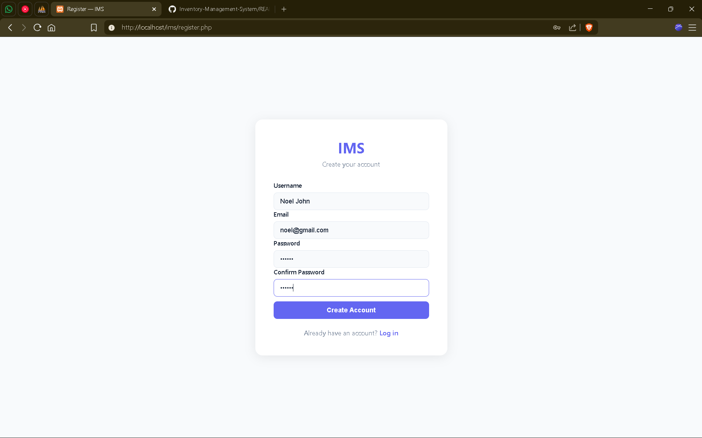
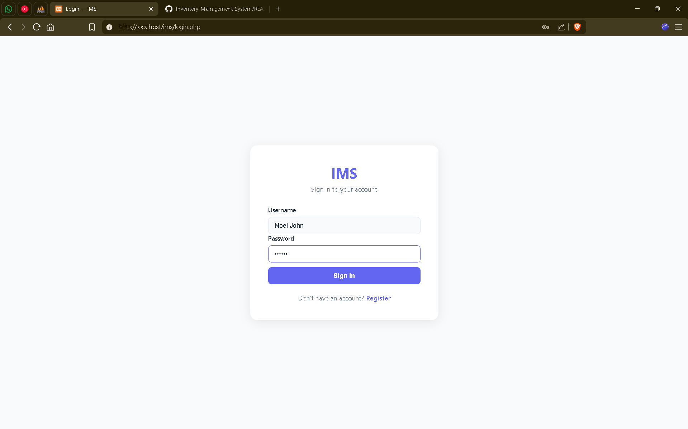
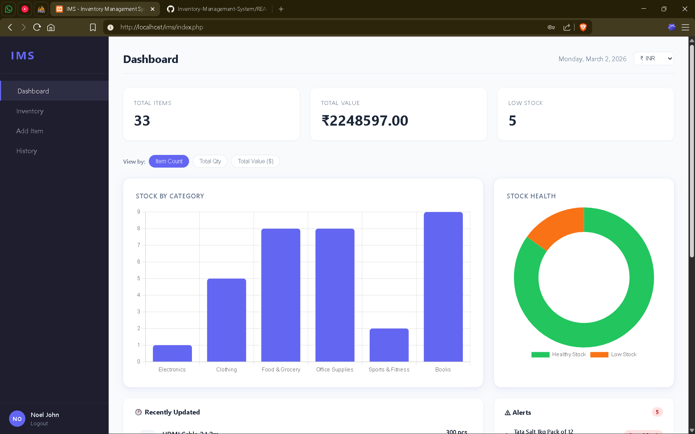
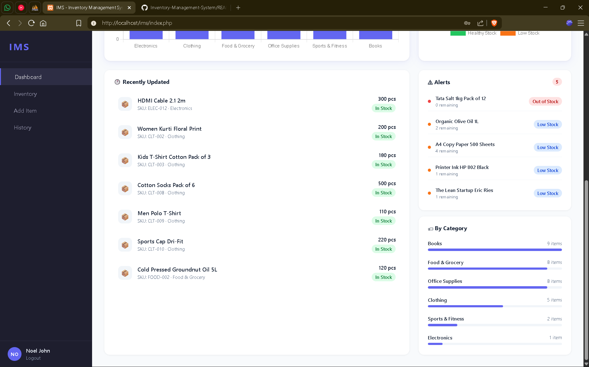
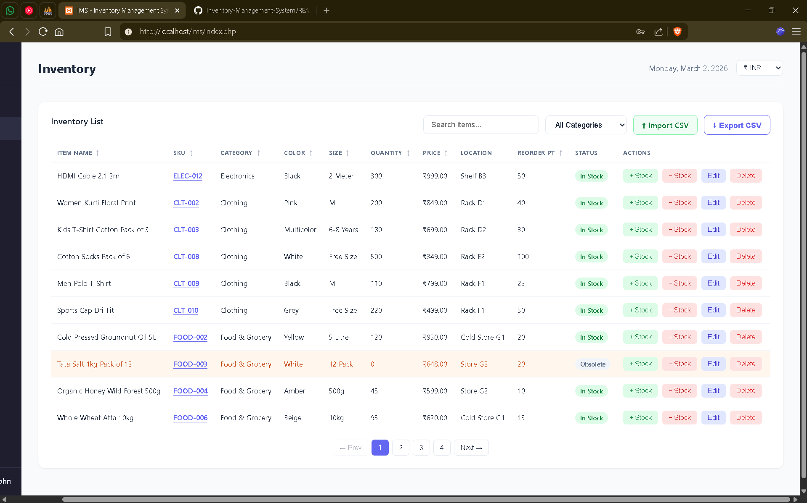
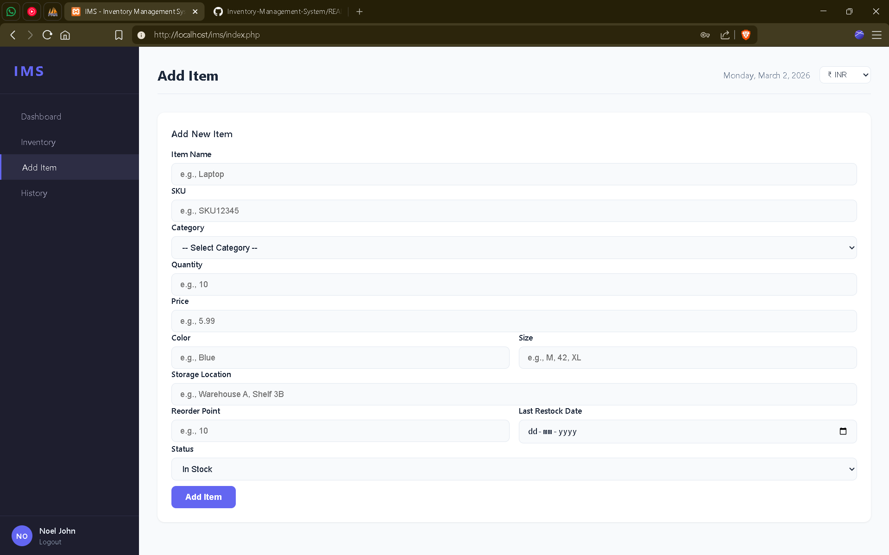
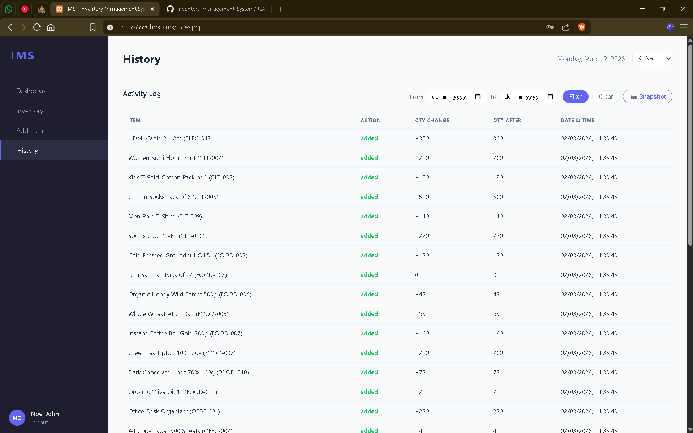

# Inventory Management System (IMS)

A full-stack, single-page Inventory Management System built with PHP, MySQL, and Vanilla JavaScript.

---

## About

IMS is a web-based inventory management tool designed for small to medium businesses that need to track stock, monitor transactions, and get a clear picture of their inventory at any point in time — without the complexity of enterprise software.

The system runs entirely in the browser as a single-page application. All data is stored in a MySQL database and served through a lightweight PHP REST API. Every action — adding an item, adjusting stock, importing a CSV — is logged to a full audit trail, which can then be used to reconstruct exactly what your inventory looked like on any given date.

**What the system can do:**

- Manage a product catalogue with up to 11 fields per item including location, reorder points, and status
- Track every stock movement (additions, removals, edits, deletions) with timestamps
- Show real-time dashboard stats — total items, total inventory value, and low stock count
- Visualise stock distribution across categories with interactive charts (click a category to drill into individual items)
- Alert you when items fall at or below their reorder threshold
- Convert all prices to any major currency using live exchange rates (base: INR)
- Let you travel back in time — pick any date and the system reconstructs your full inventory snapshot as it was on that day
- Bulk-import items from CSV and export your current inventory at any time
- Keep each user's data completely isolated — multiple users can log in without seeing each other's inventory

---

## Features

- **Inventory CRUD** — Add, edit, delete items with 11 fields (Name, SKU, Category, Color, Size, Quantity, Price, Location, Reorder Point, Last Restock Date, Status)
- **Dashboard** — Stat cards, interactive bar and doughnut charts with category drill-down, and three live widgets (Recently Updated, Alerts, By Category)
- **Live Currency Conversion** — Base INR; switch to USD, EUR, GBP, JPY, KRW with real-time exchange rates via [frankfurter.app](https://www.frankfurter.app)
- **Transaction History** — Full audit log of every change, filterable by date range
- **Point-in-Time Snapshot** — Reconstruct the exact inventory state as of any past date
- **CSV Import / Export** — Bulk import with 5 required + 6 optional columns; export current inventory
- **Search, Filter & Sort** — Live search, category filter, sortable columns, paginated table (10/page)
- **Authentication** — Per-user data isolation via PHP sessions

---

## Tech Stack

| Layer    | Technology |
|----------|------------|
| Frontend | HTML, CSS, Vanilla JS |
| Charts   | Chart.js |
| Backend  | PHP 8+ |
| Database | MySQL (MySQLi) |
| Server   | Apache (XAMPP) |

---

## Setup

1. Clone into your XAMPP `htdocs` folder:
   ```bash
   git clone https://github.com/noeljk03/Inventory-Management-System.git C:/xampp/htdocs/ims
   ```

2. Start Apache and MySQL in XAMPP Control Panel.

3. Create the `ims` database in [phpMyAdmin](http://localhost/phpmyadmin) and import `ims.sql`.

4. Configure `db.php` with your database credentials:
   ```php
   $conn = mysqli_connect('localhost', 'root', '', 'ims');
   ```

5. Open `http://localhost/ims/` and register an account.

---

## Project Structure

```
ims/
├── index.php              # Main SPA shell
├── app.js                 # All frontend logic
├── style.css              # Styles
├── db.php                 # Database connection
├── login.php / register.php / logout.php
└── api/
    ├── items.php          # Inventory CRUD (GET/POST/PUT/DELETE)
    ├── transactions.php   # History log + point-in-time snapshot
    └── import.php         # CSV bulk import
```
## Screenshots

<<<<<<< HEAD







=======


>>>>>>> 

---


## CSV Import Format

| Column             | Required |
|--------------------|----------|
| `name`             | ✅ |
| `sku`              | ✅ |
| `category`         | ✅ |
| `quantity`         | ✅ |
| `price`            | ✅ |
| `color`            | ❌ |
| `size`             | ❌ |
| `location`         | ❌ |
| `reorder_point`    | ❌ |
| `last_restock_date`| ❌ |
| `status`           | ❌ |
